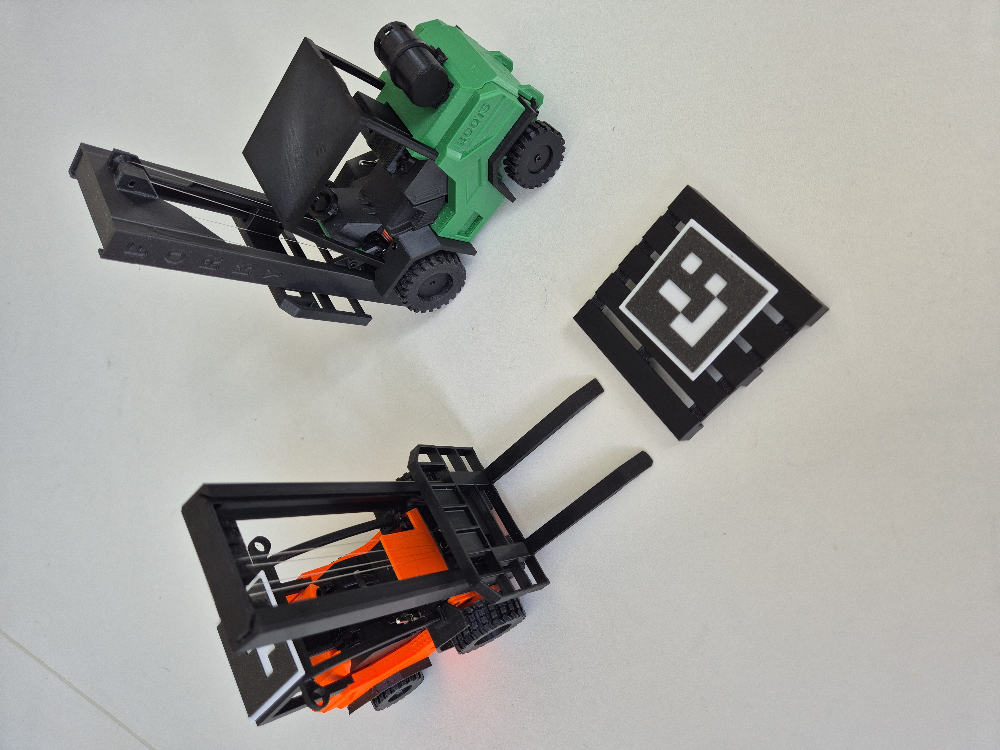

# Camera Navigated Forklift

An application for automatic localisation of a forklift and pallet using ArUco markers, followed by path planning and navigation (control) of the forklift. Project as part of assignment for courses - Mobile Robotics (0MR) and Artificial Intelligence (RAI).

Videos [here](https://drive.google.com/drive/folders/1I0BrmYF28AGaCJv-hU61jXQ6gOcWJSau?usp=drive_link&fbclid=IwY2xjawSKYypleHRuA2FlbQIxMQBzcnRjBmFwcF9pZAEwAAEeotVoscn4jFc70l5WkeKUeoDFRALwGTEwweNuVPn_y9JHAYtO-aWhbo_8BCA_aem_JSdnNN2rNKQAMNQsLFqX0w)

---

## Forklift

3D printed RC forklift from [this link](https://www.printables.com/model/1058749-3d-printed-rc-forklift-diy). The used PCB and code is also from the same author, but note that these are paid.

### Drive - ForkliftClient

The controlling ESP32 runs a web server, which receives messages and based on these messages/commands, it controls the motors. Class ForkliftClient connects to the websocket and sends the specific messages/commands.

---

## Perception

### Camera access

Camera used is OAK-D Lite. The camera captures the image for image processing and path planning.

### ArUco detection

ArUco markers are detected using the `cv2` function `cv2.aruco.ArucoDetector.detectMarkers()`. Which are then sorted based on their ID. For our application, the forklift has ID=0 and the palete has ID=1. 

### Localization

Position and angle orientation of each detected marker is calculated from the corner coordinates returned by `cv2`. function

#### Orientation angle of the marker

The orientation angle $\theta$ of a marker is calculated using the first two corners $P_0(x_0, y_0)$ and $P_1(x_1, y_1)$ of the detected marker. The `atan2` function is used to handle the correct quadrant mapping in radians. Because the direction (polarity) of the Y-axis of the image coordinate system (Y-axis increases downward) and the standard coordinate system (Y-axis increases upward) are opposite, a negative sign is added to $(y_1 - y_0)$ to convert to the standard coordinate system.

$$
\theta = atan2(-(y_1 - y_0), x_1 - x_0)
$$

#### Center position of the marker

Because the `cv2` function for ArUco marker detection returns coordinates of the four corners in the correct order, the center position $(X_c, Y_c)$ of a single marker is found simply by taking the arithmetic mean of its four corner coordinates: $P_0, P_1, P_2, P_3$.

$$
X_c = \frac{x_0 + x_1 + x_2 + x_3}{4}
$$

$$
Y_c = \frac{y_0 + y_1 + y_2 + y_3}{4}
$$

#### Pixel to millimeter conversion

Since the real-world size of the used ArUco marker is known, the ratio of pixels to mm can be calculated. The ratio is calculated from the length of the marker edge. Since ArUco markers are square-shaped, each edge should be the same length, so an average edge length $L$ is calculated like so:

$$
L_{px} = \frac{d(P_0, P_1) + d(P_1, P_2) + d(P_2, P_3) + d(P_3, P_0)}{4},
$$

where the length of a specific edge is: $d(A, B) = \sqrt{(x_A - x_B)^2 + (y_A - y_B)^2}$.

If multiple markers are detected, the function averages the pixel size across all $n$ markers to find a global average $\bar{L}_{px}$. It then calculates the conversion ratio ($Ratio_{px/mm}$) using the known physical marker size in mm ($L_{mm}$):

$$
Ratio_{px/mm} = \frac{\bar{L}_{px}}{L_{mm}}
$$

Finally, the function transforms the marker's center pixel coordinates into mm. In `get_position_simple_mm`, the Y-axis is also inverted relative to the camera frame height ($H$) so that the coordinate frame aligns with standard Cartesian mapping (where "up" is positive).

$$
X_{mm} = \frac{X_c}{Ratio_{px/mm}}
$$

$$
Y_{mm} = \frac{H - Y_c}{Ratio_{px/mm}}
$$

The size of the state space is converted to mm in the same way.

---

## Path planning

All three planners share the same pipeline:

**perception → coordinate mapping → path search → closed-loop control → replan if needed**

The only difference between them is how the path is calculated. The replan trigger and the rest of the pipeline stay the same across all three.

### Shared pipeline

#### Kinematic motion model

This module simulates the kinematic movement of the forklift using the standard **Kinematic bicycle model**. The path calculation switches automatically between straight-line integration and arc integration based on the steering angle.

##### Geometric concept

The vehicle steers around an **Instantaneous Center of Rotation (ICR)**. The turning radius $R$ is determined by the wheelbase $L$ and the steering angle $\phi$.

##### Angular velocity and heading update

The change in heading angle ($\theta$) is driven by linear velocity ($v$), the vehicle wheelbase ($L$), and the steering angle ($\phi$):

$$\Delta\theta = \frac{v}{L} \cdot \tan(\phi)$$

$$\theta_{new} = \theta + \Delta\theta \cdot dt$$

$\theta_{new}$ is automatically wrapped to the interval $[-\pi, \pi]$ to prevent overflow.

##### Position update

**Case A — Straight line** (when $|\phi| < 10^{-5}$):
When the steering angle is practically zero, coordinates update using simple linear trigonometry to avoid dividing by zero:

$$x_{new} = x + v \cdot \cos(\theta) \cdot dt$$
$$y_{new} = y + v \cdot \sin(\theta) \cdot dt$$

**Case B — Circular arc** (when $|\phi| \geq 10^{-5}$):
When turning, the vehicle moves along an arc. The exact turning radius $R$ is:

$$R = \frac{L}{\tan(\phi)}$$

The new position is computed from the change along the arc:

$$x_{new} = x + R \cdot \left(\sin(\theta_{new}) - \sin(\theta)\right)$$
$$y_{new} = y - R \cdot \left(\cos(\theta_{new}) - \cos(\theta)\right)$$

#### Coordinate mapping

The system expects a minimum of two active markers inside the frame:

- `corners[0]` — the forklift's current position and orientation
- `corners[1]` — the target pallet location

Raw pixel coordinates are converted to mm using the known physical marker size ($45\text{ mm}$). Vertical pixel coordinates are flipped ($y_{px} = \text{height} - y_{mm}$) to convert the top-left camera origin into a standard ground-plane coordinate map.

#### Closed-loop feedback and replanning

At every time step ($dt$), the controller compares the real position ($x, y, \theta$) to the expected position from the planned path:

$$\text{Error}_{\text{Pos}} = \sqrt{(x_{real} - x_{plan})^2 + (y_{real} - y_{plan})^2}$$

$$\text{Error}_{\text{Theta}} = |(\theta_{real} - \theta_{plan} + \pi) \pmod{2\pi} - \pi|$$

If $\text{Error}_{\text{Pos}} \ge 2\epsilon$ or $\text{Error}_{\text{Theta}} \ge \frac{\epsilon}{5}$, the controller identifies an unacceptable drift, stops the motors, clears old nodes, and triggers a replan.

#### Actuation scaling

When tracking within acceptable error boundaries, the raw actions (`v`, `steer`) are scaled to match hardware constraints before being sent over the socket:

$$\text{Payload}_{\text{Steer}} = \lfloor \text{deg}(\phi) \cdot 1.12 \rfloor + 100$$

$$\text{Payload}_{\text{Throttle}} = \lfloor \frac{v}{0.617} \rfloor$$

#### Goal reached — pickup sequence

When the forklift arrives within the goal tolerance zone ($\text{Distance} < 2\epsilon$), the trajectory loop stops and a fixed pickup sequence is started via `pickUpSeq()`.

---

### Architecture

The system is split into three core components:

1. **Motion Model (`ForkSim`)** — simulates bicycle steering geometry with rear-wheel characteristics
2. **Path Engine (`MainPathPlaning`, `MainPathPlaningDijkstra`)** — handles the search loop, priority queue, path reconstruction, and error thresholds
3. **Search Core (`AstarHybrid`, `KinodynamicRRT`, `Dijkstra`)** — implements grid-discretized search while tracking non-holonomic constraints

### Action space

The planners use a set of discrete motion primitives:

- Forward moves ($\approx 1.5v$ to $2v$) combined with steering angles of $\pm 30°$, $\pm 22.5°$, or $0°$
- Reverse moves ($-v$) with steering angles of $\pm 36°$ or $0°$

Simulation of forklift (`ForkSim`) is used to get new states.

---

### Hybrid A\*

An advanced path planner that combines graph search with vehicle kinematics to generate smooth, physically drivable trajectories.

#### Cost function ($f(n) = g(n) + h(n)$)

Nodes are sorted in a min-heap priority queue based on:

- **Cost from start ($g$)** — accumulated physical distance plus heading changes plus a penalty from the parent node
- **Heuristic cost to goal ($h$)** — remaining Euclidean distance plus orientation error weighted by a factor of 10, to ensure a smooth final approach

#### State quantization

To prevent too many nodes from being created in continuous coordinates ($x, y, \theta$), the space is quantized:

- Position ($x, y$) is rounded to the nearest $10\text{ mm}$
- Heading ($\theta$) is rounded to $0.1\text{ rad}$

This maps continuous vehicle physics into a discrete 3D grid checked in the `closed` lookup cache.

#### Search limits

If the open set exceeds $100{,}000$ expansions, the planner stops and returns the best path found so far.

---

### Dijkstra

This path planner uses Dijkstra agorithm for finding the best path to the goal.

#### Algorithm
Dijkstra algorithm finds the shortest path from the start to every other node in the state space. From the next node, it expands to its neighboring nodes and save new cost for these nodes. If the new cost is lower than previous cost,  the new cost is saved for this node. The algorithm runs until goal is reached.

#### Cost function
Nodes are sorted by cost. In Dijkstra algorithm,  heuristic is not used. Cost of every node depends on its distance from start.

#### State quantization
Like the Hybrid A*, the space is quantized:

- Position ($x, y$) is rounded to the $10\text{ mm}$
- Rotation ($\theta$) is rounded to $0.1\text{ rad}$

This function creates discrete grid.

---

### Kinodynamic RRT (Rapidly-exploring Random Tree)
A sample-based path planner that randomly expands the tree. First RRT will be explained, and then the kinodynamic part.

#### Algorithm of RRT
1. Randomly generate a point $q_{rand}$ within the state-space.
    - the probability of generating the goal as a point is defined with *goal bias*

2. Find the closest node to $q_{rand}$ — $q_{near}$, which will be the parent node of $q_{rand}$.

3. From $q_{near}$ move by $\Delta d$ towards $q_{rand}$ — a new node $q_{new}$ is generated. $\Delta d$ is defined by set velocity and time interval $dt$. This part will be described in more detail below, because by modifying this part it will become *kinodynamic*.

4. Check if $q_{new}$ is close enough to the goal, if yes, return the generated path.

5. Repeat up to N times

#### Kinodynamic
The reason, the kinodynamic variant was used, is because of the constraints of the real-world forklift. More specifically because the forklift is non-holonomic and it's necessary to ensure that the generated path can be followed by the real-world vehicle. 

What makes the algorithm kinodynamic is the modification of the **3. point** of the described algorithm. When new node $q_{new}$ is generated, the algorithm iterates through defined actions and runs those actions through the forklift model `ForkSim`. The action that moves the forklift closest to $q_{rand}$ is chosen as $q_{new}$. This way the algorithm respects the kinematics and dynamics of the vehicle. But the model `ForkSim` has to be accurate enough.

The replanning trigger is the same as described in the shared pipeline above.

---

## UI and telemetry

The GUI serves as the main monitor for the path planning engine. It shows real-time camera output together with the inner state of the planner.

The GUI and the path planning run in separate thread, which allows them to work without blocking each other.

### Path visualisation

When path visualisation is turned on, the planned trajectory is drawn directly on the live camera feed:

- **Red circles** — individual waypoints $(x, y)$ from the planner
- **Blue arrows** — heading direction ($\theta$) at each waypoint
- **Green lines** — connections between consecutive waypoints, tracing the arc from the motion model

### Status and controls

The desktop dashboard can be opened before any hardware is available. Select and connect a USB/OpenCV or OAK-D camera, enter the forklift IP address (the default is `192.168.4.1`), and connect the forklift from the right-hand control panel.

- **Camera and marker status** — shows camera availability and whether the two required ArUco markers are visible.
- **Planner selector** — switches between Hybrid A*, Kinodynamic RRT, and Dijkstra. Changing planner stops autonomous movement and clears the old path.
- **Show path** — toggles planned-path visualization on the camera feed.
- **Start autonomous** — becomes available when the camera, forklift, and markers are ready.
- **Manual override** — enables keyboard driving: `W/A/S/D` for movement, `J/K` for the mast, and `H/L` for tilt.
- **Emergency stop** — immediately cancels autonomous/manual operation and sends neutral movement commands.

Disconnecting hardware, losing the camera/markers, changing planners, or closing the application stops autonomous commands. The ESP32-hosted mobile controller uses a fixed viewport to prevent accidental pinch and double-tap zoom while driving.

---

## Conclusion

The current iteration of the program is partially functional and successfully demonstrates the ability to navigate the forklift and converge to the target destination. However, field tests have highlighted several core limitations regarding the hardware and localization accuracy:

* **Simulation vs. Reality:** There is a significant deviation between the physical forklift's movement and the idealized non-holonomic kinematic model used in the simulation (`ForkSim`). The mathematical model doesn't include imperfections and friction and assumes perfect traction and precise steering, which does not reflect the real-world physics of the vehicle.

* **Hardware limitations:** The 3D printed RC model lacks mechanical precision. The motors and steering mechanisms do not respond consistently to commands, leading to unpredictable movements that the path planner struggles to correct in real-time. 

* **Localization assumptions:** The ArUco marker localization currently assumes the camera is positioned perfectly perpendicular to the operational surface. Any slight angle in the camera mount introduces error into the coordinate mapping.

* **Lens distortion:** When the forklift moves toward the outer edges of the camera frame, the camera calculates incorrect coordinates. This is caused by uncorrected lens distortion, which misinterprets the scale and distance of the markers at the periphery of the image.